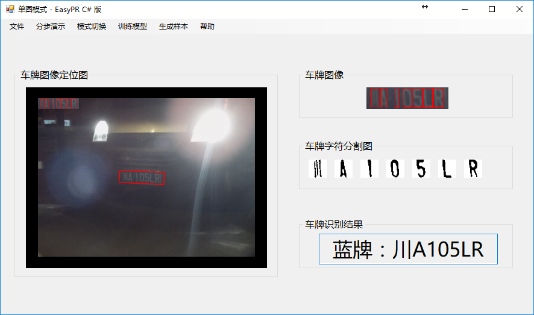
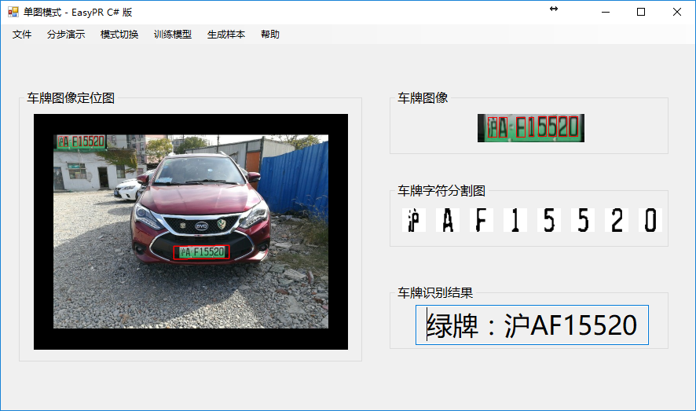
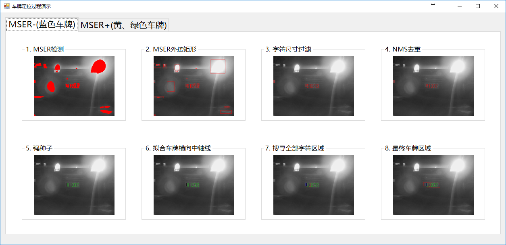
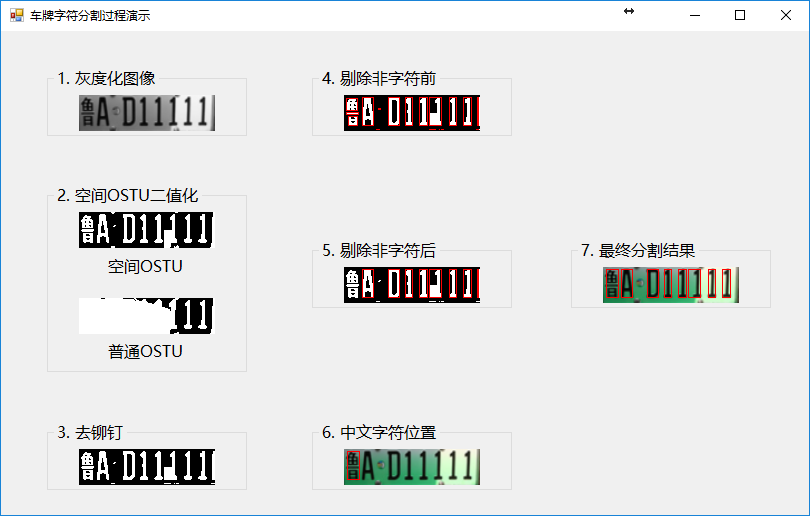
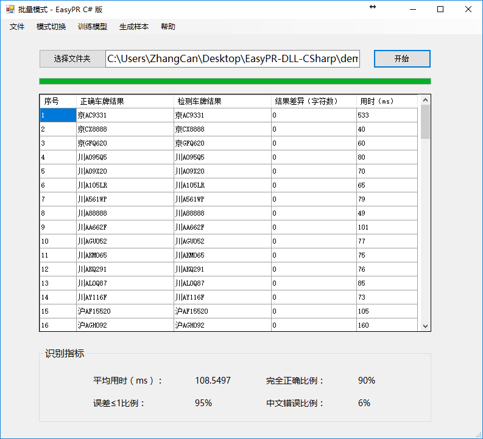
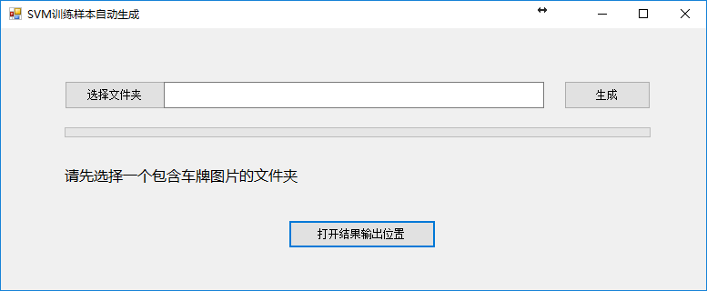

# EasyPR-DLL-CSharp

> 更多机器学习干货、最新论文解读、AI资讯热点等欢迎关注“[AI学院(FAICULTY)](https://faiculty.com/)”，内容持续更新中……

> 欢迎加入faiculty机器学习交流qq群：451429116([点此进群](//shang.qq.com/wpa/qunwpa?idkey=2a5e710043cbd1200c5ed668cd89ed29731d3daeb4d3bdf3c1a484518793df50))

> 如果本项目对你有帮助，希望可以点个★star支持哈~

### 说明
本项目基于github上的 [EasyPR](https://github.com/liuruoze/EasyPR) 项目（作者：liuruoze，版本号：1.5正式版）开发。

### 环境要求
* Microsoft Visual Studio 2013（VS2013）
* OpenCV 3.1.0

### 配置步骤

1. 下载OpenCV3.1.0，安装（即解压）
2. 添加环境变量：[opencv安装目录]\opencv\build\x64\vc12\bin
3. 下载本项目，打开解决方案文件“EasyPR-DLL-CSharp.sln”，配置“CreateDLL”项目属性：

项目 | 内容
---------------------|--------------------------------------------------------------
C/C++-附加包含目录    | [opencv的include目录];[本项目所在目录]\CreateDLL\main_file;[本项目所在目录]\CoreCode\include
链接器-附加库目录     | [opencv的lib目录]
链接器-输入-附加依赖项 | opencv_world310d.lib;%(AdditionalDependencies)

4. 配置“LibLPS”项目属性：

项目 | 内容
---------------------|--------------------------------------------------------------
C/C++-附加包含目录    | [opencv的include目录];$(SolutionDir)include;[本项目所在目录]\CoreCode\include

5. 重新生成“CreateDLL”项目
6. F5键运行C#界面程序

### 功能概览
### 1. 单图检测
C#程序初始界面为单图模式，点击“文件 - 打开”，在解决方案根目录下的“demo_img/single”文件夹中选择一张图片进行检测，如下图所示：

对于新能源的车牌的检测：

### 2. 分步演示
完成单张检测后，便可以分步查看车牌定位和字符分割过程：

### 3. 批量检测
点击“模式切换 - 批量模式”可以切换至批量检测模式。点击“选择文件夹”按钮，选择解决方案根目录下的“demo_img/multi”文件夹，点击“开始”按钮进行批量检测，下图为检测结果：

### 4. 训练SVM/ANN模型
点击“训练模型 - SVM模型/ANN模型”可以进行模型训练、查看日志文件等。

### 5. 自动样本标记工具
点击“生成样本 - SVM数据集/ANN数据集”可以进行自动样本标注。首先选择一个包含车牌图片的文件夹，点击“生成”按钮，处理结束后，可以打开结果输出的文件夹，手动调整一些错分结果。

